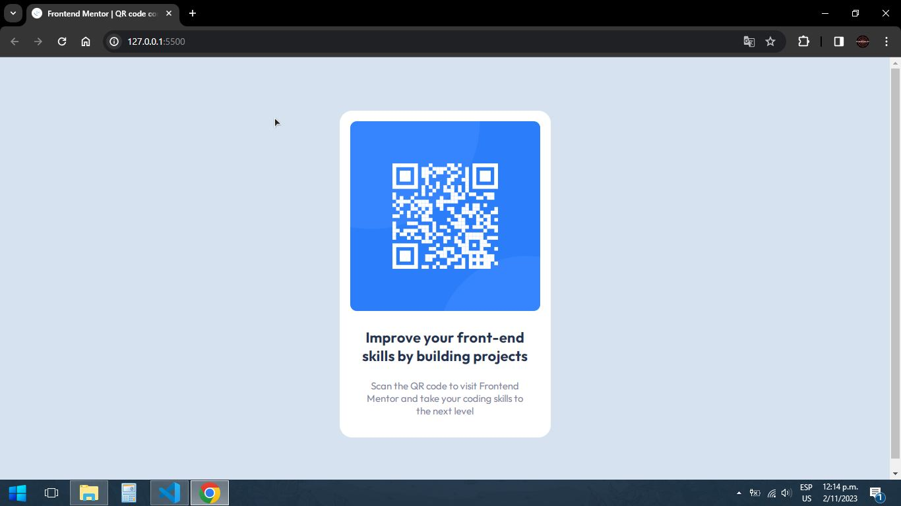

# Frontend Mentor - QR code component solution

This is a solution to the [QR code component challenge on Frontend Mentor](https://www.frontendmentor.io/challenges/qr-code-component-iux_sIO_H). Frontend Mentor challenges help you improve your coding skills by building realistic projects. 

## Table of contents

- [Overview](#overview)
  - [Screenshot](#screenshot)
  - [Links](#links)
- [My process](#my-process)
  - [Built with](#built-with)
  - [What I learned](#what-i-learned)
  - [Continued development](#continued-development)
  - [Useful resources](#useful-resources)
- [Author](#author)

**Note: Delete this note and update the table of contents based on what sections you keep.**

## Overview
This is the occasion to solve one of the most basic frontend mentor exercises, where a QR code container model and a brief description will be replicated.
### Screenshot

### Links

- Solution URL: [Add solution URL here](https://your-solution-url.com)
- Live Site URL: [Add live site URL here](https://your-live-site-url.com)

## My process

### Built with

- HTML5
- CSS
- Flex

### What I learned

This project helped me practice how to save and use variables in CSS, and it also helped me understand how to use flex and how it affects the flow of the stylesheet.

### Continued development

I would like to continue practicing with CSS, especially the flex part and how it affects everything in a project, and now I want to start using responsive design.

### Useful resources

- [Lenguaje Css](https://lenguajecss.com/) - References for css

## Author

- Github - [@pedro3015](https://github.com/pedro3015)
- Frontend Mentor - [@pedro3015](https://www.frontendmentor.io/profile/pedro3015)
- Twitter - [@alvarezpdev](https://twitter.com/alvarezpdev)

